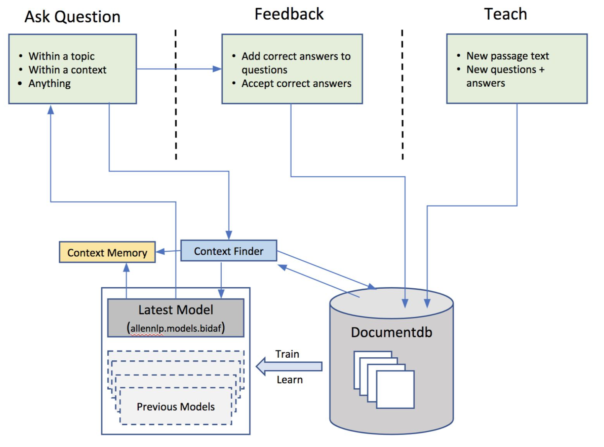

# Intelligent Question Answering System - StudyBuddyAI

## Abstract
There has been significant effort to understand and develop state of the art Question Answer systems. With the surge of deep learning, using sophisticated models such and LSTMs/GRU RNNs has become more accessible allowing researchers to test the boundaries for such systems. In this paper, we look to explore the fundamentals of such models and test the applications of Question Answering systems. In particular, we see this as a useful aid for students to extract meaningful answers from notes or text.

## Introduction
Question Answering (QA) systems aim to process some corpus of text and answer user defined questions with semantically correct responses. Although this is gaining popularity over the last year or so, QA systems date all the way back to the early 1970s with the famous LUNAR model [1]. The earlier models were typically closed domain models with structured data sets which does not scale very well. Therefore very little progress was made on QA systems until the surge of deep learning and artificial intelligence.

Fast forward to today, modern neural networks (LSTMs/ GRUs) and NLP techniques have allowed us to capture semantic and temporal information within unstructured text. This is the critical aspect to building a successful QA system. When questions are asked of large textual passages, the sequence of events are needed to be processed and understood in order to correctly answer the question. Interpreting the question and mapping that to an answer. For e.g. a “what” will find a definition in a passage whereas a “who” will find a person and a “when” will find a timeframe.
Using this technology, we would like to build a personal AI system to help learn and remember what you learnt. The same concepts could be used to build an intelligent system to help us study in a more efficient manner and ultimately coach us as we are learning. At the end of the day, the system we propose will be an intelligent note taking application.

For us, the primary use case would be a student in class attempting to processing the 100 slides that a professor is reviewing. Now, the student gets back home to review these slides, her/she may read text books, browse the internet, or read up on the additional readings from class. As this process is happening, what if they are able to log these details within our application, allowing them to easily recall the details they researched. Additionally, what if they were able to seamlessly transfer their notes onto this platform. It would build an unprecedented platform for students to extract information from their notes.

## Architecture

#### External Memory & Feedback Mechanism

Our approach to build the Intelligent Question Answering System can be seen in Figure below. We used the AllenNLP (Gardner et al., 2017) implementation of BiDAF (Seo et al., 2017) as our base model for machine comprehension. We loaded the tool with the SQuAD dataset as the base. We stored all this data in an external storage as we did not want all the data in memory. We used a documentdb (MongoDB) for storage. Then we added a Context Finder and a Context Memory module which helped the machine comprension model to answer questions based on user queries. The architecture shown in  below shows the flow of information and the three distinct phases in the learning loop of the Intelligent Question Answering System.

Architecture of external Memory & Feedback Mechanism used in our Intelligent Question Answering System

The different components in the architecture that helps in the learning loop are:

**Documentdb:** To store all the data on disk we used MongoDB. MongoDB is scalable and great at storing documents of unstructured text. The database helps to offload what we store in memory vs. what we can to store in the file system. We can then use the front end app to easily retrieve and store passages, questions, and answers.

**Model:** We used the AllenNLP (Gardner et al., 2017) implementation of BiDAF (Seo et al., 2017) as the base model. In every training cycle we pull all the passages, question, and answers from the documentdb and re-train the model. Each train cycle took around 7 hours of training time in a p2.xlarge AWS EC2 instance. We decided to save all models and built a feature in the system where you can load the system with a previously trained model. This was very helpful during the feedback and re-training cycle testing.

**Context Finder:** The context finder component helps to take a question from the user and find the relevant context and passages from which the question needs to be asked. If the question being asked is within a topic, the context finder will take the question and vectorize it and find the cosine similarity between the question and all the passages within the selected topic. The context finder will then pick the most similar passages to the question and pass the passages and question to the model to predict the answer. The answer is then sent back to the user. In the case where the user wants to ask a question with the context, the context finder will look up the context memory for the last passage in context and pass it along with the question to the model to predict the answer. The answer is then sent back to the user. In the final case where the user asks a question across all topics in the system. The context finder  will take the question and vectorize it and find the cosine similarity between the question and all the passages in the document database. The context finder will then pick the most similar passages to the question and pass the passages and question to the model to predict the answer. The answer is then sent back to the user.
For the context finder we used the cosine similarity to match questions with passages in context. In future we would like to use jaccard similarity to match questions to passages and see how the performance compares with  cosine similarity.

**Context Memory:** The context memory is used if the user does not want to repeat words again and again in questions. For example in table below we can see how the questions will need to be framed without and with the context memory. In the example the term “machine learning” will need to be repeated in every question if we do not have a context. We store the past “n” context in an array so that if the user chooses to ask questions from the context we have a history.
Questions without a context
Question with a context

<table>
<tr><td><b>Questions without a context</b></td><td><b>Question with a context</b></td></tr>
<tr><td>What is machine learning?</td><td>What is machine learning?</td></tr>
<tr><td>Who invented machine learning?</td><td>Who invented it?</td></tr>
<tr><td>When was machine learning invented?</td><td>When was it invented?</td></tr>
<tr><td>Where was machine learning invented?</td><td>Where was it invented?</td></tr>
</table>

| Questions without a context          | Question with a context           |
| ------------------------------------ |:---------------------------------:|
| What is machine learning?            | What is machine learning?         |
| Who invented machine learning?       | Who invented it?                  |
| When was machine learning invented?  | When was it invented?             |
| Where was machine learning invented? | Where was it invented?            |

The different phases in the learning loop are:

**Ask Question:** In this step the user can ask our Intelligent Question Answering System a question. The question entered is passed to the Context Finder which helps to find the context passage and the question along with passages are passed on to the model to predict the answer. The answer is sent back to the user. This flow is depicted in figure 4.2.

**Feedback:** In the feedback phase as shown in figure 4.2, the user has the ability to either “Accept” or “Reject” the answer by giving feedback on the predicted answer. If the answer is accepted the question and answer along with the passage in context are saved in the documentdb if that question does not already exist. If the user rejects the answer, they have the ability to add a correct answer for the question. This is then saved in the documentdb.

**Teach:** In this phase the user can enter new topics, new passages within a topic. Questions and answers for passages. All of this is stored in the documentdb. 

**Train, Re-train Cycle:** This step is a periodic event that will take all the passages, question, and answers from the documentdb and re-train the model. Currently we use a p2.xlarge AWS EC2 instance to re-train the model and the compressed trained model is then used in the system for all future predictions. 

## References
- [1] Question Answering Systems https://hpi.de/fileadmin/user_upload/fachgebiete/naumann/folien/SS11/Search_Engines/QuestionAnswering-SaeedehMomtazi.pdf
- [2] Ask Me Anything: Dynamic Memory Networks for Natural Language Processing https://arxiv.org/pdf/1506.07285v5.pdf
- [3] Bi-Directional Attention Flow For Machine Comprehension https://arxiv.org/pdf/1611.01603.pdf 
- [4] AllenNLP: A Deep Semantic Natural Language Processing Platform http://allennlp.org/papers/AllenNLP_white_paper.pdf 
- [5] The Stanford Question Answering Dataset
https://rajpurkar.github.io/SQuAD-explorer/ 
- [6] Learning to Answer Questions from Wikipedia Infoboxes
https://aclanthology.info/pdf/D/D16/D16-1199.pdf 
- [7] Question Answering Using Deep Learning
https://cs224d.stanford.edu/reports/StrohMathur.pdf 
- [8] Facebook BaBI Dataset
https://research.fb.com/downloads/babi/ 

